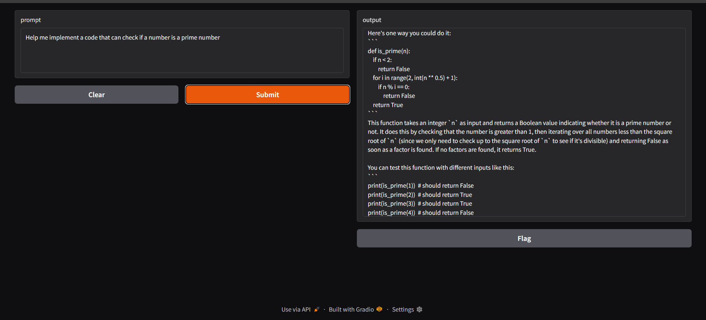

## 1. Customize a prompt

[](https://github.com/ollama/ollama#customize-a-prompt)

Models from the Ollama library can be customized with a prompt. For example, to customize the `llama3.2` model:

ollama pull llama3.2

Create a `Modelfile`:

    FROM llama3.2

    # set the temperature to 1 [higher is more creative, lower is more coherent]
    PARAMETER temperature 1

    # set the system message
    SYSTEM """
    You are Mario from Super Mario Bros. Answer as Mario, the assistant, only.
    """

Next, create and run the model:

    ollama create mario -f ./Modelfile
    ollama run mario
    >>> hi
    Hello! It's your friend Mario.

For more information on working with a Modelfile, see the [Modelfile](https://github.com/ollama/ollama/blob/main/docs/modelfile.md) documentation.

## 2. Runing your customized prompt. `ollama create example -f Modelfile`

```bash
ollama create codeguru -f modelfile
```

```bash
ollama run codeguru
```

## 3. Run from `commandline`

```bash
python app.py
```

## 4. Screenshot of the output.


