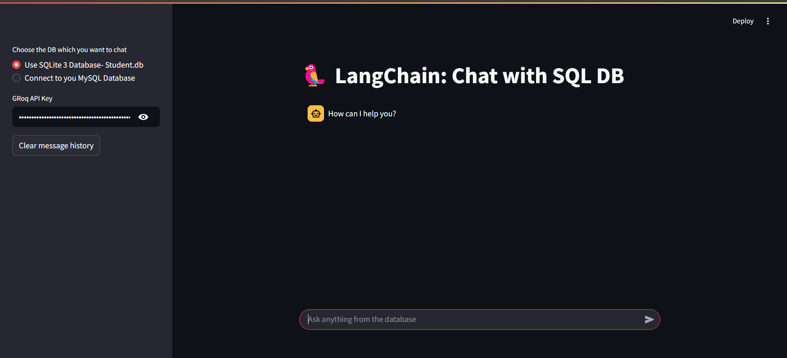
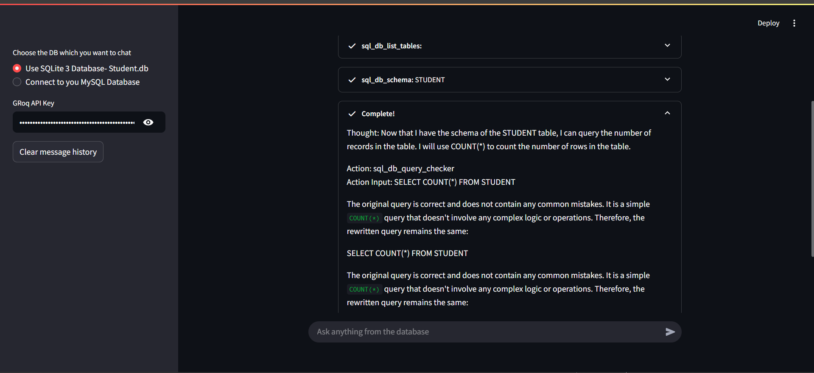
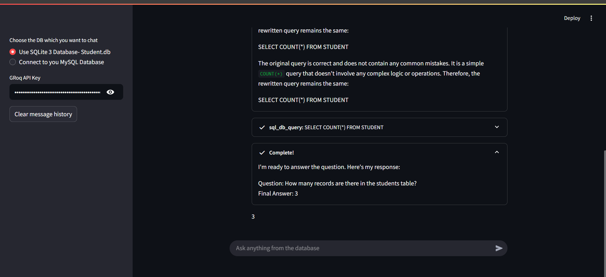
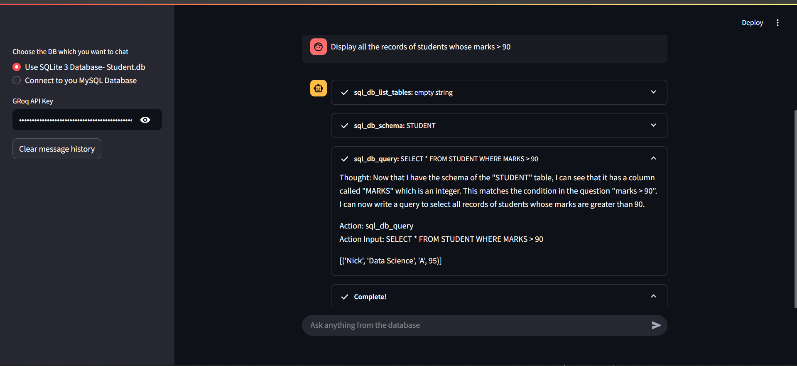
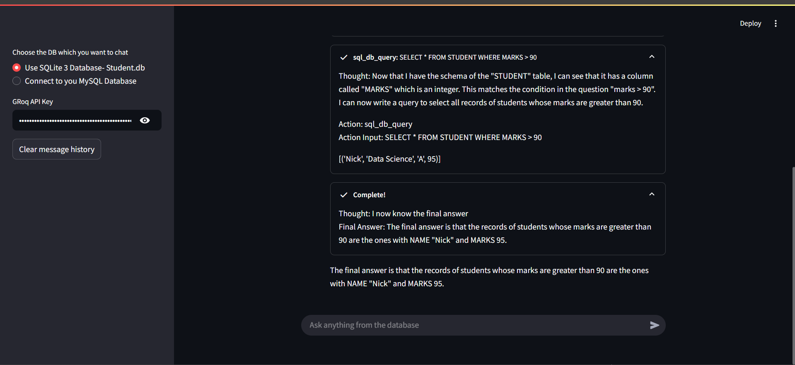
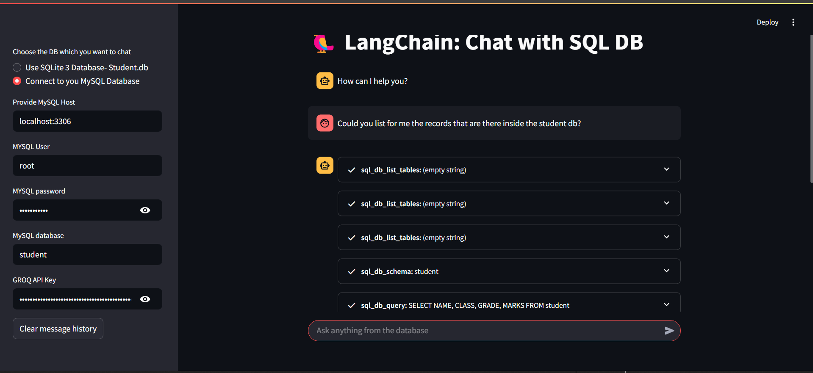
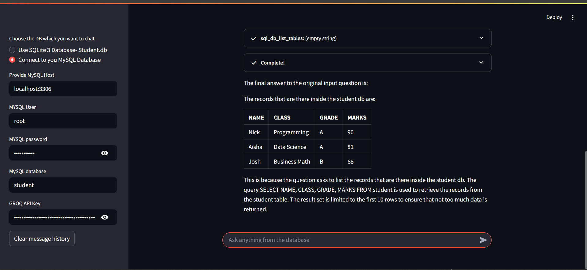

### Screenshot of the output









### Set-up and Installation.

- Running the sqlite file

```bash
python sqlite.db
```

- Run the Streamlit Web Application.

```bash
streamlit run app.py
```
