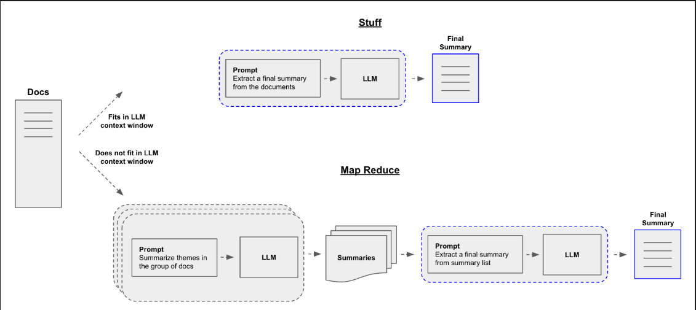

### Text Summarization Techniques.

### 1. Stuff Document Chain Summarization:

- Most basic type of summarization technique.
- So it takes for example all the contents in different pdfs for example there are 10 pdfs, then all of these contents will be combined together then it will be sent to the prompt template in text format.

#### Challenges:

- When you have many pdfs then the text will become large so it will have limit to be sent to the prompt template for token size.

### 2. Map Reduce Summarization Technique: Used for Larger files of data.

- If I have a document, Instead of combining it and sending it to prompt template we are going to divide them into smaller chunks then we pass it to a prompt template then from there we pass it to the LLM and get a summary 1, summary 2, summary 3, summary 4, then after getting all the summary we combine them and get a final summary of the entire document.
  

#### Types

- Single Prompt Template:
- Multiple Prompt Template:

### 3. Refine Chain Summarization
